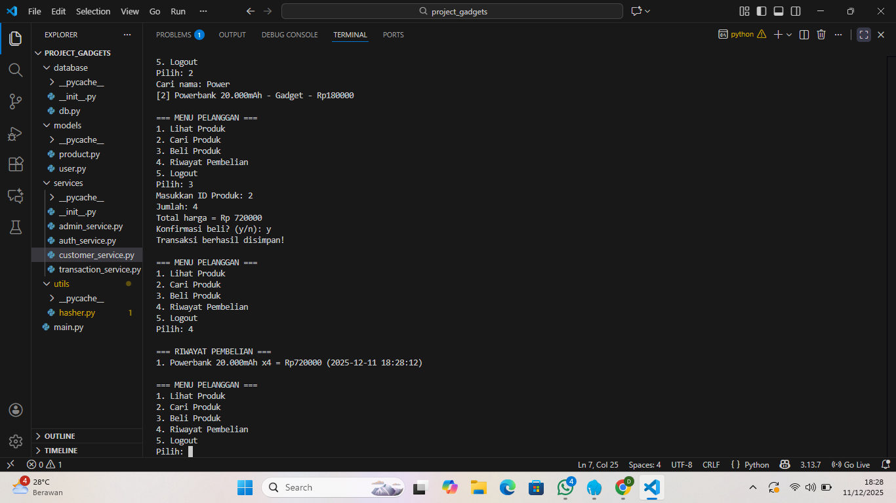
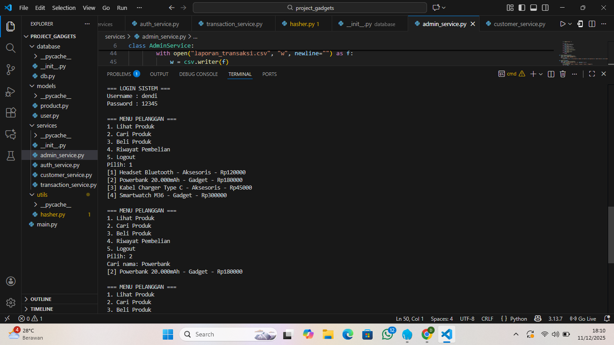

# 🛒Project Toko Gadget (Python Terminal)

**Deskripsi:**  
Project ini adalah aplikasi **toko gadget berbasis Python** yang dijalankan sepenuhnya di terminal. Aplikasi ini memudahkan pengelolaan produk, transaksi, dan laporan tanpa menggunakan HTML atau CSS. Semua interaksi dilakukan melalui **console/terminal**.  

---

<div align="center">
  
</div>

<div align="center">
  
</div>

---

## ✨Fitur

| Fitur | Status |
|-------|--------|
| 🔐 Login dengan Hashing Password | ✔ |
| 👥 Role Admin & Pelanggan | ✔ |
| 📝 CRUD Produk (Create, Read, Update, Delete) | ✔ |
| 🔍 Pencarian Produk | ✔ |
| 💳 Transaksi Pembelian | ✔ |
| 📜 Riwayat Transaksi | ✔ |
| 📊 Export CSV Laporan Transaksi | ✔ |
| 🧩 Modul & Package Python | ✔ |
| 🏗️ Pemrograman Berorientasi Objek (OOP) lengkap | ✔ |
| 🔄 Percabangan & Perulangan | ✔ |
| 🖥️ Console UI lebih rapi | ✔ |

---

## 🛠️Teknologi & Library

- **Python 3.x**  
- Library standar Python:
  - `hashlib` → untuk hashing password  
  - `csv` → untuk export laporan  
  - `os` → untuk clear screen dan navigasi  
  - `datetime` → untuk timestamp transaksi
- Database MySql

---

## 🚀Cara Menjalankan

1. Pastikan Python 3.x sudah terinstall di sistem Anda.  
2. Clone repository ini:
   ```bash
   git clone https://github.com/username/project_toko_gadget.git
3. Masuk ke direktori project:
   ```bash
   cd project_toko_gadget
4. Jalankan aplikasi:
   ```bash
   python main.py

---

## 📖Cara Penggunaan

Login dengan akun Admin atau Pelanggan.
Admin dapat:
➕ Menambahkan, ✏️ mengedit, dan ❌ menghapus produk.
📜 Melihat semua transaksi.
📊 Mengekspor laporan transaksi ke CSV.

Pelanggan dapat:
🔍 Melihat daftar produk.
💳 Melakukan pembelian.
📜 Melihat riwayat transaksi pribadi.

---

## 🌟Keunggulan

🖥️ Terminal UI yang rapi, memudahkan navigasi tanpa GUI.
🏗️ Full OOP, memudahkan pengembangan dan pemeliharaan kode.
🔐 Keamanan password menggunakan hashing.
📊 Laporan transaksi dapat langsung diekspor ke CSV.

---

## 🤝Kontribusi

Kontribusi sangat welcome! Jika ingin menambahkan fitur atau memperbaiki bug, silakan fork repository ini dan buat pull request.
